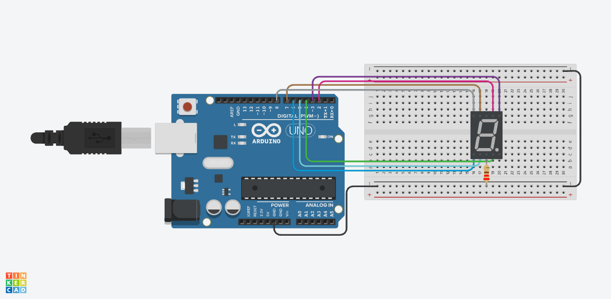
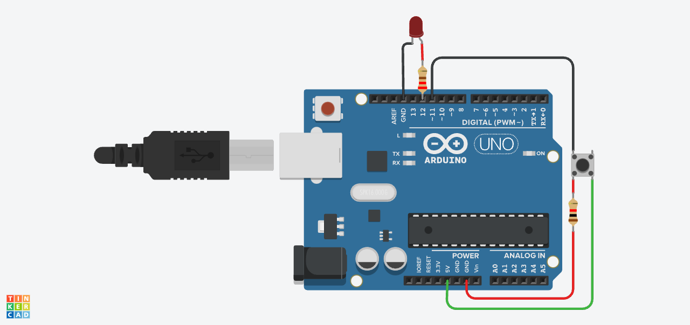

<h1 align="center"> Arduino Repotsitory<h1>

This repository will be updated with the latest Arduino codes that I make:

<ul>
    <li>🎲 Random numbers on a seven segment screen (nine sided dice simulator)</li>
    <ul>
        <li>
        
Diagram:

        
        </li>
    </ul>
    <li>
        
💡🎛️ Led Controller:

        Provide a full control over the led using a four pin momentary push button.
        <ul>
            <li>
            
Diagram:

                
            </li>
        </ul>
    </li>
<h3 align="right">-GoldTryck<h3>